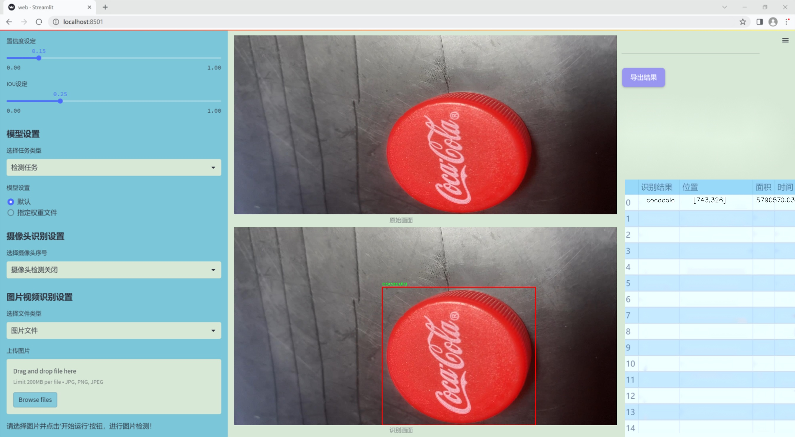
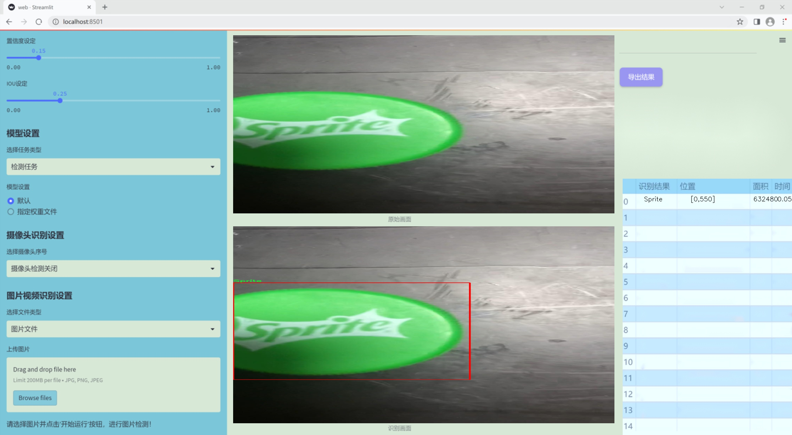
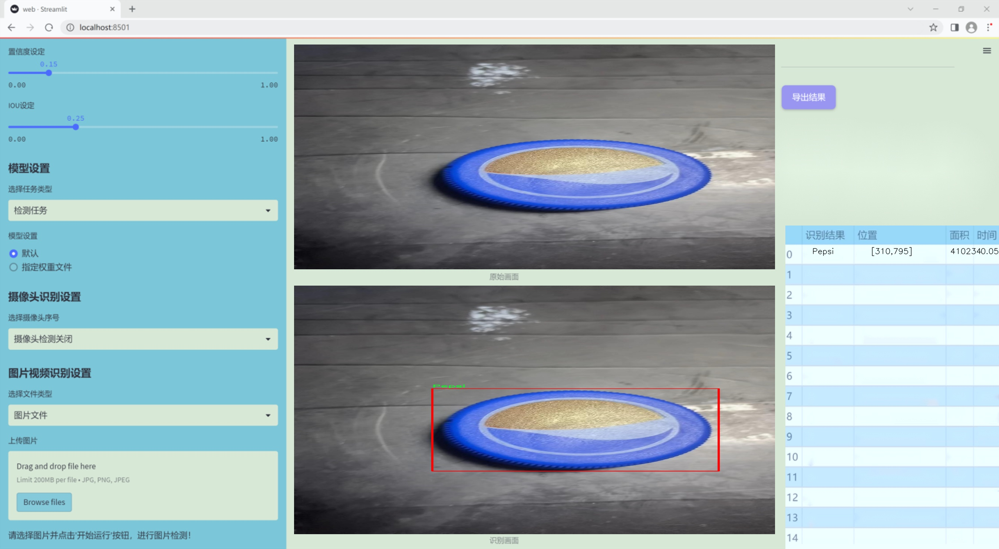
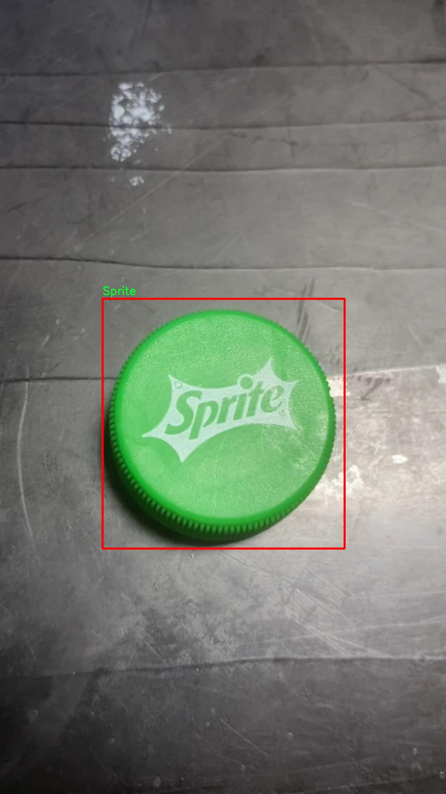
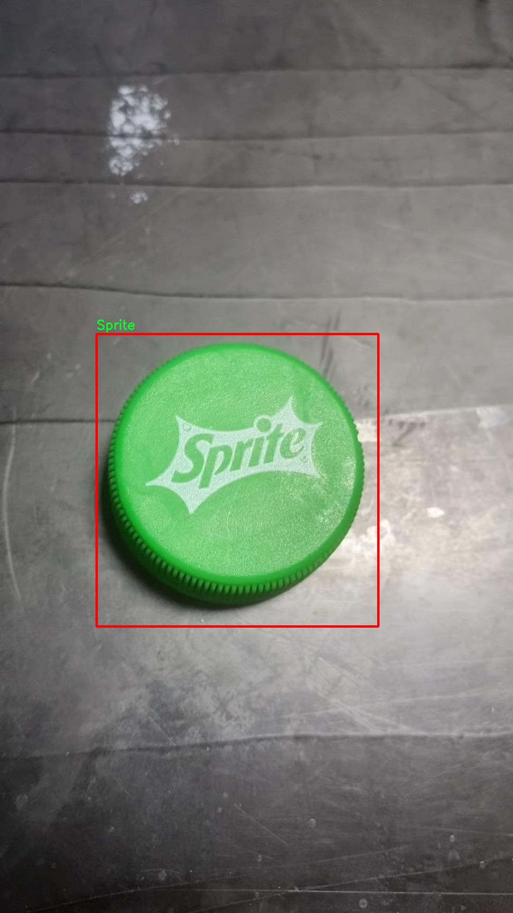
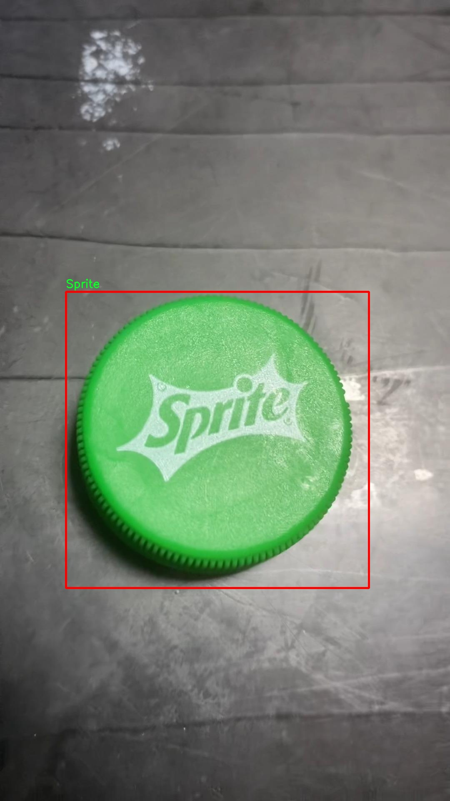
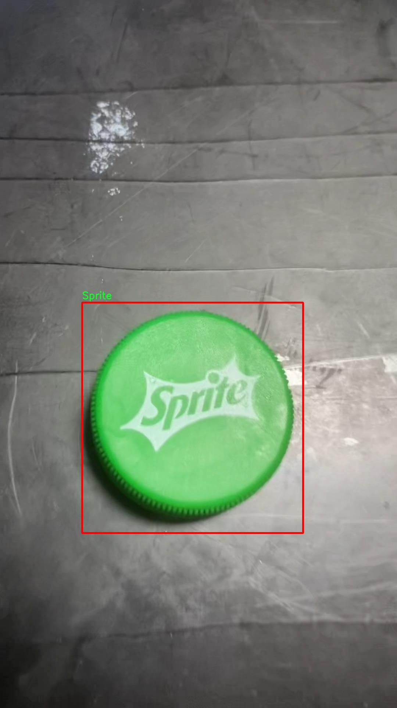
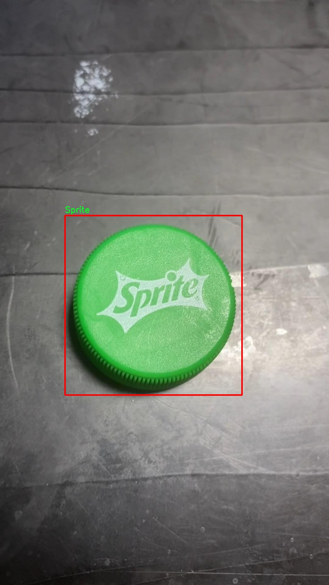

### 1.背景意义

研究背景与意义

随着消费市场的不断发展，饮料行业竞争愈发激烈，品牌识别和市场营销的有效性成为企业成功的关键因素之一。在这一背景下，饮料瓶盖的品牌识别不仅可以帮助企业进行市场分析，还能为消费者提供便捷的选择依据。因此，构建一个高效的饮料品牌瓶盖识别系统具有重要的实际意义和应用价值。

本研究基于改进的YOLOv11模型，旨在实现对五种主要饮料品牌瓶盖的自动识别，包括Pepsi、Sprite、TamSaaSoo、cider和cocacola。该系统的开发依赖于一个包含711张图像的数据集，这些图像经过精心标注，并采用YOLOv8格式进行处理。数据集的构建过程强调了图像的自动方向调整，以确保在不同拍摄条件下的图像一致性，从而提高模型的训练效果。

在计算机视觉领域，YOLO（You Only Look Once）系列模型因其快速和准确的特性而广受欢迎。YOLOv11作为该系列的最新版本，进一步提升了目标检测的精度和速度，使其成为饮料瓶盖识别的理想选择。通过对YOLOv11的改进，我们期望在识别准确率和处理速度上实现显著提升，以满足实际应用中的需求。

此外，随着人工智能技术的不断进步，基于深度学习的图像识别系统在商业智能、自动化生产和智能营销等领域的应用潜力巨大。通过本研究的实施，不仅可以为饮料行业提供一种新的品牌识别工具，还可以为相关领域的研究提供借鉴和参考，推动计算机视觉技术在实际应用中的广泛应用。总之，基于改进YOLOv11的饮料品牌瓶盖识别系统的研究，不仅具有重要的学术价值，也将为饮料行业的数字化转型提供有力支持。

### 2.视频效果

[2.1 视频效果](https://www.bilibili.com/video/BV1GPUnYrEQS/)

### 3.图片效果







##### [项目涉及的源码数据来源链接](https://kdocs.cn/l/cszuIiCKVNis)**

注意：本项目提供训练的数据集和训练教程,由于版本持续更新,暂不提供权重文件（best.pt）,请按照6.训练教程进行训练后实现上图演示的效果。

### 4.数据集信息

##### 4.1 本项目数据集类别数＆类别名

nc: 5
names: ['Pepsi', 'Sprite', 'TamSaaSoo', 'cider', 'cocacola']


该项目为【目标检测】数据集，请在【训练教程和Web端加载模型教程（第三步）】这一步的时候按照【目标检测】部分的教程来训练

##### 4.2 本项目数据集信息介绍

本项目数据集信息介绍

本项目旨在改进YOLOv11模型，以实现对饮料品牌瓶盖的高效识别。为此，我们构建了一个专门的数据集，涵盖了五种主要的饮料品牌瓶盖，具体包括Pepsi、Sprite、TamSaaSoo、cider和cocacola。这些品牌在市场上具有广泛的认知度和代表性，因而选择它们作为数据集的核心类别，能够有效提升模型的实际应用价值。

数据集的构建过程注重多样性和代表性，确保所收集的瓶盖图像能够覆盖不同的拍摄角度、光照条件和背景环境。每个类别的样本数量均衡，旨在避免模型在训练过程中出现偏倚现象。通过精心挑选和标注图像，我们为每个品牌瓶盖提供了详尽的标签信息，以便于YOLOv11模型进行准确的训练和评估。

此外，数据集还包括了一些额外的挑战性样本，例如部分瓶盖在不同的环境中可能会受到遮挡或变形，这为模型的鲁棒性提供了更高的要求。通过引入这些复杂的场景，我们希望提升模型在实际应用中的适应能力，使其能够在多变的环境中仍然保持高效的识别性能。

在数据集的后续使用中，我们将持续收集用户反馈，并根据实际应用情况不断更新和扩展数据集，以涵盖更多的饮料品牌和瓶盖样式。这一动态更新的策略不仅能够增强模型的学习能力，还能确保其在市场变化中保持竞争力。最终，我们期望通过这一数据集的支持，推动饮料品牌瓶盖识别技术的发展，为相关行业提供更为精准和高效的解决方案。











### 5.全套项目环境部署视频教程（零基础手把手教学）

[5.1 所需软件PyCharm和Anaconda安装教程（第一步）](https://www.bilibili.com/video/BV1BoC1YCEKi/?spm_id_from=333.999.0.0&vd_source=bc9aec86d164b67a7004b996143742dc)


[5.2 安装Python虚拟环境创建和依赖库安装视频教程（第二步）](https://www.bilibili.com/video/BV1ZoC1YCEBw?spm_id_from=333.788.videopod.sections&vd_source=bc9aec86d164b67a7004b996143742dc)

### 6.改进YOLOv11训练教程和Web_UI前端加载模型教程（零基础手把手教学）

[6.1 改进YOLOv11训练教程和Web_UI前端加载模型教程（第三步）](https://www.bilibili.com/video/BV1BoC1YCEhR?spm_id_from=333.788.videopod.sections&vd_source=bc9aec86d164b67a7004b996143742dc)


按照上面的训练视频教程链接加载项目提供的数据集，运行train.py即可开始训练



     Epoch   gpu_mem       box       obj       cls    labels  img_size
     1/200     20.8G   0.01576   0.01955  0.007536        22      1280: 100%|██████████| 849/849 [14:42<00:00,  1.04s/it]
               Class     Images     Labels          P          R     mAP@.5 mAP@.5:.95: 100%|██████████| 213/213 [01:14<00:00,  2.87it/s]
                 all       3395      17314      0.994      0.957      0.0957      0.0843

     Epoch   gpu_mem       box       obj       cls    labels  img_size
     2/200     20.8G   0.01578   0.01923  0.007006        22      1280: 100%|██████████| 849/849 [14:44<00:00,  1.04s/it]
               Class     Images     Labels          P          R     mAP@.5 mAP@.5:.95: 100%|██████████| 213/213 [01:12<00:00,  2.95it/s]
                 all       3395      17314      0.996      0.956      0.0957      0.0845

     Epoch   gpu_mem       box       obj       cls    labels  img_size
     3/200     20.8G   0.01561    0.0191  0.006895        27      1280: 100%|██████████| 849/849 [10:56<00:00,  1.29it/s]
               Class     Images     Labels          P          R     mAP@.5 mAP@.5:.95: 100%|███████   | 187/213 [00:52<00:00,  4.04it/s]
                 all       3395      17314      0.996      0.957      0.0957      0.0845


###### [项目数据集下载链接](https://kdocs.cn/l/cszuIiCKVNis)

### 7.原始YOLOv11算法讲解

YOLO11采用改进的骨干和颈部架构，增强了特征提取能力，提高了物体检测的精确度和复杂任务的表现。YOLO11引入精炼的架构设计和优化的训练流程，实现更快的处理速度，同时保持精度和性能之间的最佳平衡。通过模型设计的进步，YOLO11m在COCO数据集上实现了更高的均值平均精度（mAP），同时使用比YOLOv8m少22%的参数，使其在不妥协准确性的情况下更加计算高效。YOLO11可以无缝部署在各种环境中，包括边缘设备、云平台以及支持NVIDIA
GPU的系统，确保最大灵活性。无论是物体检测、实例分割、图像分类、姿态估计，还是定向物体检测（OBB），YOLO11都旨在应对多样的计算机视觉挑战。


##### **Ultralytics YOLO11相比于之前版本的主要改进有哪些？**

Ultralytics YOLO11在其前身基础上引入了几项重要进步。主要改进包括：

  1. **增强的特征提取** ：YOLO11采用改进的骨干和颈部架构，增强了特征提取能力，提高了物体检测的精确度。
  2.  **优化的效率和速度** ：精炼的架构设计和优化的训练流程实现了更快的处理速度，同时保持了准确性和性能之间的平衡。
  3.  **更高的准确性与更少的参数** ：YOLO11m在COCO数据集上实现了更高的均值平均精度（mAP），同时使用比YOLOv8m少22%的参数，使其在不妥协准确性的情况下更加计算高效。
  4.  **环境适应性强** ：YOLO11可以在多种环境中部署，包括边缘设备、云平台以及支持NVIDIA GPU的系统。
  5.  **支持广泛的任务** ：YOLO11支持多种计算机视觉任务，如物体检测、实例分割、图像分类、姿态估计和定向物体检测（OBB）。

我们先来看一下其网络结构有什么变化，可以看出，相比较于YOLOv8模型，其将CF2模块改成C3K2，同时在SPPF模块后面添加了一个C2PSA模块，且将YOLOv10的head思想引入到YOLO11的head中，使用深度可分离的方法，减少冗余计算，提高效率。下面我们来详细看一下这两个模块的结构是怎么构成的，以及它们为什么要这样设计


##### C3K2的网络结构

从下面图中我们可以看到，C3K2模块其实就是C2F模块转变出来的，它代码中有一个设置，就是当c3k这个参数为FALSE的时候，C3K2模块就是C2F模块，也就是说它的Bottleneck是普通的Bottleneck；反之当它为true的时候，将Bottleneck模块替换成C3模块。


##### C2PSA的网络结构

` `C2PSA是对 `C2f` 模块的扩展，它结合了PSA(Pointwise Spatial
Attention)块，用于增强特征提取和注意力机制。通过在标准 `C2f` 模块中引入 PSA
块，C2PSA实现了更强大的注意力机制，从而提高了模型对重要特征的捕捉能力。


##### **C2f 模块回顾：**

**** C2f模块是一个更快的 CSP（Cross Stage Partial）瓶颈实现，它通过两个卷积层和多个 Bottleneck
块进行特征提取。相比传统的 CSPNet，C2f 优化了瓶颈层的结构，使得计算速度更快。在 C2f中，`cv1` 是第一个 1x1
卷积，用于减少通道数；`cv2` 是另一个 1x1 卷积，用于恢复输出通道数。而 `n` 是一个包含 Bottleneck 块的数量，用于提取特征。

##### **C2PSA 模块的增强** ：

**C2PSA** 扩展了 C2f，通过引入PSA( **Position-Sensitive Attention)**
，旨在通过多头注意力机制和前馈神经网络来增强特征提取能力。它可以选择性地添加残差结构（shortcut）以优化梯度传播和网络训练效果。同时，使用FFN
可以将输入特征映射到更高维的空间，捕获输入特征的复杂非线性关系，允许模型学习更丰富的特征表示。

##### head部分

YOLO11在head部分的cls分支上使用深度可分离卷积 ，具体代码如下，cv2边界框回归分支，cv3分类分支。

    
    
     self.cv2 = nn.ModuleList(
                nn.Sequential(Conv(x, c2, 3), Conv(c2, c2, 3), nn.Conv2d(c2, 4 * self.reg_max, 1)) for x in ch
            )
            self.cv3 = nn.ModuleList(
                nn.Sequential(
                    nn.Sequential(DWConv(x, x, 3), Conv(x, c3, 1)),
                    nn.Sequential(DWConv(c3, c3, 3), Conv(c3, c3, 1)),
                    nn.Conv2d(c3, self.nc, 1),
                )
                for x in ch
            )


### 8.200+种全套改进YOLOV11创新点原理讲解

#### 8.1 200+种全套改进YOLOV11创新点原理讲解大全

由于篇幅限制，每个创新点的具体原理讲解就不全部展开，具体见下列网址中的改进模块对应项目的技术原理博客网址【Blog】（创新点均为模块化搭建，原理适配YOLOv5~YOLOv11等各种版本）

[改进模块技术原理博客【Blog】网址链接](https://gitee.com/qunmasj/good)


#### 8.2 精选部分改进YOLOV11创新点原理讲解

###### 这里节选部分改进创新点展开原理讲解(完整的改进原理见上图和[改进模块技术原理博客链接](https://gitee.com/qunmasj/good)【如果此小节的图加载失败可以通过CSDN或者Github搜索该博客的标题访问原始博客，原始博客图片显示正常】
### CBAM空间注意力机制
近年来，随着深度学习研究方向的火热，注意力机制也被广泛地应用在图像识别、语音识别和自然语言处理等领域，注意力机制在深度学习任务中发挥着举足轻重的作用。注意力机制借鉴于人类的视觉系统，例如，人眼在看到一幅画面时，会倾向于关注画面中的重要信息，而忽略其他可见的信息。深度学习中的注意力机制和人类视觉的注意力机制相似，通过扫描全局数据，从大量数据中选择出需要重点关注的、对当前任务更为重要的信息，然后对这部分信息分配更多的注意力资源，从这些信息中获取更多所需要的细节信息，而抑制其他无用的信息。而在深度学习中，则具体表现为给感兴趣的区域更高的权重，经过网络的学习和调整，得到最优的权重分配，形成网络模型的注意力，使网络拥有更强的学习能力，加快网络的收敛速度。
注意力机制通常可分为软注意力机制和硬注意力机制[4-5]。软注意力机制在选择信息时，不是从输入的信息中只选择1个，而会用到所有输入信息，只是各个信息对应的权重分配不同，然后输入网络模型进行计算;硬注意力机制则是从输入的信息中随机选取一个或者选择概率最高的信息，但是这一步骤通常是不可微的，导致硬注意力机制更难训练。因此，软注意力机制应用更为广泛，按照原理可将软注意力机制划分为:通道注意力机制（channel attention)、空间注意力机制(spatial attention）和混合域注意力机制(mixed attention)。
通道注意力机制的本质建立各个特征通道之间的重要程度，对感兴趣的通道进行重点关注，弱化不感兴趣的通道的作用;空间注意力的本质则是建模了整个空间信息的重要程度，然后对空间内感兴趣的区域进行重点关注，弱化其余非感兴趣区域的作用;混合注意力同时运用了通道注意力和空间注意力，两部分先后进行或并行，形成对通道特征和空间特征同时关注的注意力模型。

卷积层注意力模块(Convolutional Block Attention Module，CBAM）是比较常用的混合注意力模块，其先后集中了通道注意力模块和空间注意力模块，网络中加入该模块能有效提高网络性能，减少网络模型的计算量，模块结构如图所示。输入特征图首先经过分支的通道注意力模块，然后和主干的原特征图融合，得到具有通道注意力的特征图，接着经过分支的空间注意力模块，在和主干的特征图融合后，得到同时具有通道特征注意力和空间特征注意力的特征图。CBAM模块不改变输入特征图的大小，因此该模块是一个“即插即用”的模块，可以插入网络的任何位置。

通道注意力模块的结构示意图如图所示，通道注意力模块分支并行地对输入的特征图进行最大池化操作和平均池化操作，然后利用多层感知机对结果进行变换，得到应用于两个通道的变换结果，最后经过sigmoid激活函数将变换结果融合，得到具有通道注意力的通道特征图。

空间注意力模块示意图如图所示，将通道注意力模块输出的特征图作为该模块的输入特征图，首先对输入特征图进行基于通道的最大池化操作和平均池化操作，将两部分得到的结果拼接起来，然后通过卷积得到降为Ⅰ通道的特征图，最后通过sigmoid激活函数生成具有空间注意力的特征图。


### 9.系统功能展示

图9.1.系统支持检测结果表格显示

  图9.2.系统支持置信度和IOU阈值手动调节

  图9.3.系统支持自定义加载权重文件best.pt(需要你通过步骤5中训练获得)

  图9.4.系统支持摄像头实时识别

  图9.5.系统支持图片识别

  图9.6.系统支持视频识别

  图9.7.系统支持识别结果文件自动保存

  图9.8.系统支持Excel导出检测结果数据


### 10. YOLOv11核心改进源码讲解

#### 10.1 test_selective_scan.py

以下是对您提供的代码进行的核心部分提取和详细中文注释。代码的核心功能是实现选择性扫描（Selective Scan），并且支持反向传播。以下是简化后的代码及其注释：

```python
import torch
import torch.nn.functional as F

def build_selective_scan_fn(selective_scan_cuda: object = None, mode="mamba_ssm"):
    """
    构建选择性扫描函数，支持不同的模式。
    
    参数:
    selective_scan_cuda: CUDA实现的选择性扫描函数
    mode: 模式选择
    """
    
    class SelectiveScanFn(torch.autograd.Function):
        @staticmethod
        def forward(ctx, u, delta, A, B, C, D=None, z=None, delta_bias=None, delta_softplus=False, return_last_state=False):
            """
            前向传播函数，计算选择性扫描的输出。
            
            参数:
            ctx: 上下文对象，用于保存信息以供反向传播使用
            u: 输入张量
            delta: 变化率张量
            A, B, C: 权重张量
            D: 可选的张量
            z: 可选的张量
            delta_bias: 可选的偏置
            delta_softplus: 是否使用softplus激活
            return_last_state: 是否返回最后状态
            
            返回:
            输出张量或输出和最后状态的元组
            """
            # 确保输入张量是连续的
            u = u.contiguous()
            delta = delta.contiguous()
            if D is not None:
                D = D.contiguous()
            B = B.contiguous()
            C = C.contiguous()
            if z is not None:
                z = z.contiguous()

            # 选择性扫描的前向计算
            out, x, *rest = selective_scan_cuda.fwd(u, delta, A, B, C, D, z, delta_bias, delta_softplus)
            
            # 保存用于反向传播的张量
            ctx.save_for_backward(u, delta, A, B, C, D, z, delta_bias, x)
            last_state = x[:, :, -1, 1::2]  # 获取最后状态
            return out if not return_last_state else (out, last_state)

        @staticmethod
        def backward(ctx, dout):
            """
            反向传播函数，计算梯度。
            
            参数:
            ctx: 上下文对象，包含前向传播时保存的信息
            dout: 输出的梯度
            
            返回:
            输入张量的梯度
            """
            u, delta, A, B, C, D, z, delta_bias, x = ctx.saved_tensors
            
            # 反向计算梯度
            du, ddelta, dA, dB, dC, dD, ddelta_bias, *rest = selective_scan_cuda.bwd(
                u, delta, A, B, C, D, z, delta_bias, dout, x
            )
            
            return (du, ddelta, dA, dB, dC, dD, None, ddelta_bias, None)

    def selective_scan_fn(u, delta, A, B, C, D=None, z=None, delta_bias=None, delta_softplus=False, return_last_state=False):
        """
        选择性扫描函数的接口。
        
        参数:
        u, delta, A, B, C, D, z, delta_bias, delta_softplus, return_last_state: 同上
        
        返回:
        输出张量或输出和最后状态的元组
        """
        return SelectiveScanFn.apply(u, delta, A, B, C, D, z, delta_bias, delta_softplus, return_last_state)

    return selective_scan_fn

# 选择性扫描的参考实现
def selective_scan_ref(u, delta, A, B, C, D=None, z=None, delta_bias=None, delta_softplus=False, return_last_state=False):
    """
    选择性扫描的参考实现，主要用于验证。
    
    参数:
    u, delta, A, B, C, D, z, delta_bias, delta_softplus, return_last_state: 同上
    
    返回:
    输出张量或输出和最后状态的元组
    """
    # 将输入转换为浮点类型
    u = u.float()
    delta = delta.float()
    if delta_bias is not None:
        delta = delta + delta_bias[..., None].float()
    if delta_softplus:
        delta = F.softplus(delta)

    # 初始化状态
    batch, dim, dstate = u.shape[0], A.shape[0], A.shape[1]
    x = A.new_zeros((batch, dim, dstate))
    ys = []

    # 计算选择性扫描的输出
    for i in range(u.shape[2]):
        x = delta[:, :, i] * x + B[:, :, i]  # 更新状态
        y = torch.einsum('bdn,dn->bd', x, C)  # 计算输出
        ys.append(y)

    out = torch.stack(ys, dim=2)  # 堆叠输出
    return out if not return_last_state else (out, x)

# 示例用法
selective_scan_fn = build_selective_scan_fn(selective_scan_cuda=None, mode="mamba_ssm")
```

### 代码核心部分分析：
1. **选择性扫描函数的构建**：`build_selective_scan_fn`函数用于创建选择性扫描的前向和反向传播函数。根据不同的模式，选择不同的CUDA实现。

2. **前向传播**：`SelectiveScanFn.forward`方法实现了选择性扫描的前向计算，计算输入张量的输出，并保存必要的张量以供反向传播使用。

3. **反向传播**：`SelectiveScanFn.backward`方法实现了反向传播，计算输入张量的梯度。

4. **参考实现**：`selective_scan_ref`函数提供了选择性扫描的参考实现，用于验证CUDA实现的正确性。

5. **示例用法**：最后展示了如何使用构建的选择性扫描函数。

以上是对代码的核心部分提取和详细注释，希望对您理解代码的功能和结构有所帮助。

这个文件 `test_selective_scan.py` 是一个用于测试选择性扫描（Selective Scan）操作的 Python 脚本，主要使用 PyTorch 框架进行深度学习相关的计算。文件中包含了选择性扫描的实现、参考实现以及一系列的测试用例。

首先，文件中定义了一个 `build_selective_scan_fn` 函数，该函数用于构建一个选择性扫描的自定义操作。这个操作通过 PyTorch 的自动求导功能实现了前向和反向传播。具体来说，`SelectiveScanFn` 类继承自 `torch.autograd.Function`，并实现了 `forward` 和 `backward` 两个静态方法。`forward` 方法负责计算选择性扫描的输出，而 `backward` 方法则计算梯度。

在 `forward` 方法中，输入的张量（如 `u`, `delta`, `A`, `B`, `C` 等）会经过一系列的处理，包括确保张量是连续的、调整维度、以及数据类型的转换等。然后根据不同的模式（如 `mamba_ssm`, `ssoflex`, `sscore` 等），调用相应的 CUDA 函数进行计算。计算完成后，结果会被保存以便在反向传播时使用。

反向传播的实现同样复杂，涉及到多个输入的梯度计算。根据模式的不同，反向传播的实现也会有所不同。最终，`backward` 方法返回所有输入的梯度。

接下来，文件中定义了两个参考实现 `selective_scan_ref` 和 `selective_scan_ref_v2`，这两个函数提供了选择性扫描的基本计算逻辑，主要用于与自定义操作的输出进行比较，确保自定义实现的正确性。

在文件的最后部分，使用了 `pytest` 框架来定义一系列的测试用例。通过 `@pytest.mark.parametrize` 装饰器，定义了多个参数组合，测试不同输入条件下的选择性扫描操作。测试函数 `test_selective_scan` 中，首先生成一系列随机输入，然后调用自定义的选择性扫描函数和参考实现，比较它们的输出和梯度，确保两者在数值上是相近的。

总的来说，这个文件实现了选择性扫描操作的高效计算，并通过测试确保了实现的正确性，适用于需要进行复杂张量运算的深度学习任务。

#### 10.2 dyhead_prune.py

以下是代码中最核心的部分，并附上详细的中文注释：

```python
import torch
import torch.nn as nn
import torch.nn.functional as F

class DyReLU(nn.Module):
    """动态ReLU激活函数，能够根据输入动态调整激活值的参数。
    
    Args:
        inp (int): 输入通道数。
        reduction (int): 压缩比例，决定中间层的通道数。
        lambda_a (float): 动态调整的参数。
        K2 (bool): 是否使用偏置。
        use_bias (bool): 是否使用偏置。
        use_spatial (bool): 是否使用空间注意力。
        init_a (list): 初始化参数a的值。
        init_b (list): 初始化参数b的值。
    """
    
    def __init__(self, inp, reduction=4, lambda_a=1.0, K2=True, use_bias=True, use_spatial=False,
                 init_a=[1.0, 0.0], init_b=[0.0, 0.0]):
        super(DyReLU, self).__init__()
        self.oup = inp  # 输出通道数
        self.lambda_a = lambda_a * 2  # 动态调整参数
        self.K2 = K2  # 是否使用K2
        self.avg_pool = nn.AdaptiveAvgPool2d(1)  # 自适应平均池化层

        self.use_bias = use_bias  # 是否使用偏置
        # 根据是否使用偏置和K2决定exp的值
        self.exp = 4 if use_bias else 2 if K2 else 2 if use_bias else 1
        
        # 确定压缩比例
        squeeze = inp // reduction if reduction == 4 else _make_divisible(inp // reduction, 4)

        # 定义全连接层
        self.fc = nn.Sequential(
            nn.Linear(inp, squeeze),  # 输入到压缩层
            nn.ReLU(inplace=True),  # ReLU激活
            nn.Linear(squeeze, self.oup * self.exp),  # 压缩层到输出层
            h_sigmoid()  # 使用h_sigmoid激活
        )
        
        # 如果使用空间注意力，定义空间卷积层
        self.spa = nn.Sequential(
            nn.Conv2d(inp, 1, kernel_size=1),  # 1x1卷积
            nn.BatchNorm2d(1),  # 批归一化
        ) if use_spatial else None

    def forward(self, x):
        """前向传播函数，计算动态ReLU的输出。
        
        Args:
            x (Tensor): 输入张量，可以是列表或单个张量。
        
        Returns:
            Tensor: 输出张量。
        """
        # 如果输入是列表，分别获取输入和输出
        if isinstance(x, list):
            x_in = x[0]
            x_out = x[1]
        else:
            x_in = x
            x_out = x
        
        b, c, h, w = x_in.size()  # 获取输入的形状
        y = self.avg_pool(x_in).view(b, c)  # 进行自适应平均池化
        y = self.fc(y).view(b, self.oup * self.exp, 1, 1)  # 通过全连接层
        
        # 根据exp的值计算输出
        if self.exp == 4:
            a1, b1, a2, b2 = torch.split(y, self.oup, dim=1)  # 分割输出
            a1 = (a1 - 0.5) * self.lambda_a + self.init_a[0]  # 调整参数a1
            a2 = (a2 - 0.5) * self.lambda_a + self.init_a[1]  # 调整参数a2
            b1 = b1 - 0.5 + self.init_b[0]  # 调整参数b1
            b2 = b2 - 0.5 + self.init_b[1]  # 调整参数b2
            out = torch.max(x_out * a1 + b1, x_out * a2 + b2)  # 计算输出
        elif self.exp == 2:
            if self.use_bias:  # 如果使用偏置
                a1, b1 = torch.split(y, self.oup, dim=1)  # 分割输出
                a1 = (a1 - 0.5) * self.lambda_a + self.init_a[0]  # 调整参数a1
                b1 = b1 - 0.5 + self.init_b[0]  # 调整参数b1
                out = x_out * a1 + b1  # 计算输出
            else:
                a1, a2 = torch.split(y, self.oup, dim=1)  # 分割输出
                a1 = (a1 - 0.5) * self.lambda_a + self.init_a[0]  # 调整参数a1
                a2 = (a2 - 0.5) * self.lambda_a + self.init_a[1]  # 调整参数a2
                out = torch.max(x_out * a1, x_out * a2)  # 计算输出
        elif self.exp == 1:
            a1 = y  # 直接使用y
            a1 = (a1 - 0.5) * self.lambda_a + self.init_a[0]  # 调整参数a1
            out = x_out * a1  # 计算输出

        # 如果使用空间注意力，计算空间注意力并调整输出
        if self.spa:
            ys = self.spa(x_in).view(b, -1)  # 计算空间注意力
            ys = F.softmax(ys, dim=1).view(b, 1, h, w) * h * w  # 归一化
            ys = F.hardtanh(ys, 0, 3, inplace=True) / 3  # 限制范围
            out = out * ys  # 调整输出

        return out  # 返回最终输出

class DyDCNv2(nn.Module):
    """带有归一化层的可调变形卷积模块，用于DyHead。
    
    Args:
        in_channels (int): 输入通道数。
        out_channels (int): 输出通道数。
        stride (int | tuple[int], optional): 卷积的步幅，默认为1。
        norm_cfg (dict, optional): 归一化层的配置字典，默认为组归一化。
    """
    
    def __init__(self, in_channels, out_channels, stride=1, norm_cfg=dict(type='GN', num_groups=16, requires_grad=True)):
        super().__init__()
        self.with_norm = norm_cfg is not None  # 是否使用归一化
        bias = not self.with_norm  # 如果不使用归一化，则使用偏置
        self.conv = ModulatedDeformConv2d(
            in_channels, out_channels, 3, stride=stride, padding=1, bias=bias)  # 定义可调变形卷积
        if self.with_norm:
            self.norm = build_norm_layer(norm_cfg, out_channels)[1]  # 定义归一化层

    def forward(self, x, offset, mask):
        """前向传播函数。
        
        Args:
            x (Tensor): 输入张量。
            offset (Tensor): 偏移量。
            mask (Tensor): 掩码。
        
        Returns:
            Tensor: 输出张量。
        """
        x = self.conv(x.contiguous(), offset, mask)  # 进行卷积操作
        if self.with_norm:
            x = self.norm(x)  # 如果使用归一化，则进行归一化
        return x  # 返回输出

class DyHeadBlock_Prune(nn.Module):
    """DyHead块，包含三种类型的注意力机制。
    
    Args:
        in_channels (int): 输入通道数。
        norm_type (str): 归一化类型，默认为'GN'。
        zero_init_offset (bool): 是否将偏移量初始化为零。
        act_cfg (dict): 激活函数的配置字典。
    """
    
    def __init__(self, in_channels, norm_type='GN', zero_init_offset=True, act_cfg=dict(type='HSigmoid', bias=3.0, divisor=6.0)):
        super().__init__()
        self.zero_init_offset = zero_init_offset  # 是否将偏移量初始化为零
        self.offset_and_mask_dim = 3 * 3 * 3  # 偏移量和掩码的维度
        self.offset_dim = 2 * 3 * 3  # 偏移量的维度

        # 根据归一化类型选择归一化配置
        norm_dict = dict(type='GN', num_groups=16, requires_grad=True) if norm_type == 'GN' else dict(type='BN', requires_grad=True)
        
        # 定义三个不同尺度的可调变形卷积
        self.spatial_conv_high = DyDCNv2(in_channels, in_channels, norm_cfg=norm_dict)
        self.spatial_conv_mid = DyDCNv2(in_channels, in_channels)
        self.spatial_conv_low = DyDCNv2(in_channels, in_channels, stride=2)
        
        # 定义偏移量和掩码的卷积层
        self.spatial_conv_offset = nn.Conv2d(in_channels, self.offset_and_mask_dim, 3, padding=1)
        
        # 定义尺度注意力模块
        self.scale_attn_module = nn.Sequential(
            nn.AdaptiveAvgPool2d(1),  # 自适应平均池化
            nn.Conv2d(in_channels, 1, 1),  # 1x1卷积
            nn.ReLU(inplace=True),  # ReLU激活
            build_activation_layer(act_cfg)  # 根据配置构建激活层
        )
        
        # 定义任务注意力模块
        self.task_attn_module = DyReLU(in_channels)  # 使用动态ReLU
        self._init_weights()  # 初始化权重

    def _init_weights(self):
        """初始化权重函数。"""
        for m in self.modules():
            if isinstance(m, nn.Conv2d):
                normal_init(m, 0, 0.01)  # 正态初始化卷积层
        if self.zero_init_offset:
            constant_init(self.spatial_conv_offset, 0)  # 如果需要，将偏移量初始化为零

    def forward(self, x, level):
        """前向传播函数。
        
        Args:
            x (list): 输入特征图列表。
            level (int): 当前特征图的层级。
        
        Returns:
            Tensor: 输出张量。
        """
        # 计算DCNv2的偏移量和掩码
        offset_and_mask = self.spatial_conv_offset(x[level])
        offset = offset_and_mask[:, :self.offset_dim, :, :]  # 获取偏移量
        mask = offset_and_mask[:, self.offset_dim:, :, :].sigmoid()  # 获取掩码并应用sigmoid

        mid_feat = self.spatial_conv_mid(x[level], offset, mask)  # 中间特征的卷积
        sum_feat = mid_feat * self.scale_attn_module(mid_feat)  # 应用尺度注意力
        
        summed_levels = 1  # 计数已加和的层级
        if level > 0:  # 如果有低层特征
            low_feat = self.spatial_conv_low(x[level - 1], offset, mask)  # 低层特征的卷积
            sum_feat += low_feat * self.scale_attn_module(low_feat)  # 加入低层特征
            summed_levels += 1  # 增加计数
        if level < len(x) - 1:  # 如果有高层特征
            high_feat = F.interpolate(
                self.spatial_conv_high(x[level + 1], offset, mask),
                size=x[level].shape[-2:],  # 进行上采样
                mode='bilinear',
                align_corners=True)
            sum_feat += high_feat * self.scale_attn_module(high_feat)  # 加入高层特征
            summed_levels += 1  # 增加计数

        return self.task_attn_module(sum_feat / summed_levels)  # 返回任务注意力模块的输出
```

以上代码是一个实现动态激活函数和可调变形卷积的模块，包含了动态ReLU、可调变形卷积以及结合多层特征的注意力机制。每个类和方法都附有详细的中文注释，帮助理解其功能和实现细节。

这个程序文件 `dyhead_prune.py` 是一个用于深度学习模型的模块，主要实现了动态头（Dynamic Head）中的一些组件，特别是与注意力机制和卷积操作相关的部分。代码使用了 PyTorch 框架，并且引入了一些外部库，如 `mmcv` 和 `mmengine`，用于构建激活层和归一化层。

首先，文件中定义了一个 `_make_divisible` 函数，用于确保某个值是可被指定因子整除的，并且在调整时不会减少超过 10%。这个函数在构建网络时常用于调整通道数，以便更好地适应硬件的要求。

接下来，定义了几个激活函数的类，包括 `swish`、`h_swish` 和 `h_sigmoid`。这些类都是继承自 `nn.Module`，并实现了 `forward` 方法，分别对应不同的激活函数，提供了在深度学习模型中常用的非线性变换。

`DyReLU` 类是一个动态激活函数模块，它的设计允许根据输入特征动态调整激活函数的参数。构造函数中定义了输入通道数、缩减比例、偏置使用与否等参数，并构建了一个全连接层用于生成动态参数。`forward` 方法中根据输入特征计算出激活值，并结合空间注意力机制进行加权。

`DyDCNv2` 类实现了一个带有归一化层的可调变形卷积（Modulated Deformable Convolution），它的构造函数接收输入和输出通道数、步幅以及归一化配置。`forward` 方法则执行卷积操作，并在需要时应用归一化。

`DyHeadBlock_Prune` 类是整个模块的核心，包含了三个不同层次的注意力机制。构造函数中初始化了多个卷积层和注意力模块。`_init_weights` 方法用于初始化卷积层的权重，并根据需要将偏置初始化为零。`forward` 方法则计算输入特征的偏移和掩码，并通过不同层次的卷积操作生成特征图，最后结合注意力机制输出结果。

总体而言，这个文件实现了一个复杂的动态头模块，结合了动态激活函数、可调变形卷积和多层次的注意力机制，旨在提高深度学习模型在图像处理任务中的表现。

#### 10.3 EfficientFormerV2.py

以下是代码中最核心的部分，并附上详细的中文注释：

```python
import torch
import torch.nn as nn
import math
import itertools

class Attention4D(nn.Module):
    def __init__(self, dim=384, key_dim=32, num_heads=8, attn_ratio=4, resolution=7, act_layer=nn.ReLU, stride=None):
        super().__init__()
        self.num_heads = num_heads  # 注意力头的数量
        self.scale = key_dim ** -0.5  # 缩放因子
        self.key_dim = key_dim  # 键的维度
        self.nh_kd = key_dim * num_heads  # 总的键维度

        # 如果有步幅，则进行卷积和上采样
        if stride is not None:
            self.resolution = math.ceil(resolution / stride)  # 计算新的分辨率
            self.stride_conv = nn.Sequential(
                nn.Conv2d(dim, dim, kernel_size=3, stride=stride, padding=1, groups=dim),
                nn.BatchNorm2d(dim),
            )
            self.upsample = nn.Upsample(scale_factor=stride, mode='bilinear')
        else:
            self.resolution = resolution
            self.stride_conv = None
            self.upsample = None

        self.N = self.resolution ** 2  # 分辨率的平方
        self.d = int(attn_ratio * key_dim)  # 输出的维度
        self.dh = self.d * num_heads  # 总的输出维度
        self.attn_ratio = attn_ratio  # 注意力比率

        # 定义查询、键、值的卷积层
        self.q = nn.Sequential(nn.Conv2d(dim, self.num_heads * self.key_dim, 1), nn.BatchNorm2d(self.num_heads * self.key_dim))
        self.k = nn.Sequential(nn.Conv2d(dim, self.num_heads * self.key_dim, 1), nn.BatchNorm2d(self.num_heads * self.key_dim))
        self.v = nn.Sequential(nn.Conv2d(dim, self.num_heads * self.d, 1), nn.BatchNorm2d(self.num_heads * self.d))

        # 定义局部值的卷积层
        self.v_local = nn.Sequential(
            nn.Conv2d(self.num_heads * self.d, self.num_heads * self.d, kernel_size=3, stride=1, padding=1, groups=self.num_heads * self.d),
            nn.BatchNorm2d(self.num_heads * self.d),
        )

        # 定义注意力机制中的 talking head
        self.talking_head1 = nn.Conv2d(self.num_heads, self.num_heads, kernel_size=1, stride=1, padding=0)
        self.talking_head2 = nn.Conv2d(self.num_heads, self.num_heads, kernel_size=1, stride=1, padding=0)

        # 最后的投影层
        self.proj = nn.Sequential(act_layer(), nn.Conv2d(self.dh, dim, 1), nn.BatchNorm2d(dim))

        # 计算注意力偏置
        points = list(itertools.product(range(self.resolution), range(self.resolution)))
        N = len(points)
        attention_offsets = {}
        idxs = []
        for p1 in points:
            for p2 in points:
                offset = (abs(p1[0] - p2[0]), abs(p1[1] - p2[1]))
                if offset not in attention_offsets:
                    attention_offsets[offset] = len(attention_offsets)
                idxs.append(attention_offsets[offset])
        self.attention_biases = nn.Parameter(torch.zeros(num_heads, len(attention_offsets)))  # 注意力偏置参数
        self.register_buffer('attention_bias_idxs', torch.LongTensor(idxs).view(N, N))  # 注册偏置索引

    @torch.no_grad()
    def train(self, mode=True):
        super().train(mode)
        if mode and hasattr(self, 'ab'):
            del self.ab  # 删除之前的注意力偏置
        else:
            self.ab = self.attention_biases[:, self.attention_bias_idxs]  # 训练时使用的偏置

    def forward(self, x):  # 前向传播
        B, C, H, W = x.shape  # 获取输入的形状
        if self.stride_conv is not None:
            x = self.stride_conv(x)  # 如果有步幅，则进行卷积

        # 计算查询、键、值
        q = self.q(x).flatten(2).reshape(B, self.num_heads, -1, self.N).permute(0, 1, 3, 2)
        k = self.k(x).flatten(2).reshape(B, self.num_heads, -1, self.N).permute(0, 1, 2, 3)
        v = self.v(x)
        v_local = self.v_local(v)
        v = v.flatten(2).reshape(B, self.num_heads, -1, self.N).permute(0, 1, 3, 2)

        # 计算注意力权重
        attn = (q @ k) * self.scale + (self.attention_biases[:, self.attention_bias_idxs] if self.training else self.ab)
        attn = self.talking_head1(attn)
        attn = attn.softmax(dim=-1)  # 归一化
        attn = self.talking_head2(attn)

        # 计算输出
        x = (attn @ v)
        out = x.transpose(2, 3).reshape(B, self.dh, self.resolution, self.resolution) + v_local
        if self.upsample is not None:
            out = self.upsample(out)  # 上采样

        out = self.proj(out)  # 投影
        return out

# EfficientFormerV2模型的定义
class EfficientFormerV2(nn.Module):
    def __init__(self, layers, embed_dims=None, mlp_ratios=4, downsamples=None, num_classes=1000, resolution=640, e_ratios=None):
        super().__init__()
        self.patch_embed = stem(3, embed_dims[0])  # 初始的卷积嵌入层

        network = []
        for i in range(len(layers)):
            stage = eformer_block(embed_dims[i], i, layers, mlp_ratio=mlp_ratios, resolution=math.ceil(resolution / (2 ** (i + 2))), e_ratios=e_ratios)
            network.append(stage)  # 添加每一层的模块

            # 如果需要下采样，则添加Embedding层
            if downsamples[i] or embed_dims[i] != embed_dims[i + 1]:
                network.append(Embedding(patch_size=3, stride=2, in_chans=embed_dims[i], embed_dim=embed_dims[i + 1], resolution=math.ceil(resolution / (2 ** (i + 2)))))

        self.network = nn.ModuleList(network)  # 将网络模块化

    def forward(self, x):
        x = self.patch_embed(x)  # 通过嵌入层
        for block in self.network:
            x = block(x)  # 通过每一层
        return x  # 返回输出
```

### 代码说明：
1. **Attention4D 类**：实现了一个四维注意力机制，包括查询、键、值的计算和注意力权重的生成。
2. **EfficientFormerV2 类**：构建了整个EfficientFormerV2模型，包括嵌入层和多个模块的堆叠。
3. **前向传播**：在`forward`方法中，输入数据通过嵌入层和后续的网络模块进行处理，最终输出结果。

这段代码的核心在于如何通过注意力机制和多层网络结构来提取特征，适用于图像分类等任务。

这个程序文件定义了一个名为 `EfficientFormerV2` 的深度学习模型，主要用于图像处理任务。代码中包含了模型的各个组成部分，包括不同的层、模块和功能。以下是对代码的详细讲解。

首先，文件中导入了一些必要的库，包括 `torch` 和 `torch.nn`，这些是构建深度学习模型的基础库。接着，定义了一些模型的参数，包括不同版本的宽度和深度，这些参数会影响模型的复杂度和性能。

`EfficientFormer_width` 和 `EfficientFormer_depth` 字典分别定义了不同模型版本的通道数和层数。模型的宽度和深度决定了网络的容量和学习能力。接下来，定义了一些扩展比率，这些比率用于调整模型中某些层的特征图大小。

`Attention4D` 类实现了一个四维注意力机制，它的构造函数中定义了多个卷积层和批归一化层，用于处理输入数据并计算注意力权重。`forward` 方法实现了前向传播过程，计算输入的注意力输出。

`stem` 函数定义了模型的初始卷积层，用于将输入图像转换为特征图。`LGQuery` 类用于生成局部查询特征，结合了平均池化和卷积操作。

`Attention4DDownsample` 类与 `Attention4D` 类类似，但它实现了下采样功能，以减少特征图的分辨率。`Embedding` 类用于将输入图像嵌入到特征空间中，支持不同的嵌入方式。

`Mlp` 类实现了一个多层感知机（MLP），使用1x1卷积进行特征转换。`AttnFFN` 和 `FFN` 类则分别实现了带有注意力机制的前馈网络和普通前馈网络。

`eformer_block` 函数用于构建模型的基本块，根据传入的参数动态生成不同的层。`EfficientFormerV2` 类是整个模型的核心，包含了多个基本块和嵌入层，负责处理输入并生成输出特征。

在模型的 `forward` 方法中，输入数据首先经过嵌入层，然后依次通过各个基本块进行处理，最终返回特征输出。

最后，文件中定义了一些函数，如 `update_weight` 用于更新模型权重，`efficientformerv2_s0`、`efficientformerv2_s1`、`efficientformerv2_s2` 和 `efficientformerv2_l` 用于创建不同版本的 `EfficientFormerV2` 模型，并加载预训练权重。

在 `__main__` 部分，代码演示了如何使用这些模型，生成随机输入并打印每个模型的输出特征图的尺寸。这部分代码可以用来测试模型的构建和前向传播是否正常。

总体来说，这个程序文件实现了一个高效的图像处理模型，结合了注意力机制和多层感知机，适用于各种计算机视觉任务。

#### 10.4 cfpt.py

以下是代码中最核心的部分，并附上详细的中文注释：

```python
import torch
import torch.nn as nn
import torch.nn.functional as F
from timm.layers import to_2tuple, trunc_normal_

class CrossLayerPosEmbedding3D(nn.Module):
    def __init__(self, num_heads=4, window_size=(5, 3, 1), spatial=True):
        super(CrossLayerPosEmbedding3D, self).__init__()
        self.spatial = spatial  # 是否使用空间位置嵌入
        self.num_heads = num_heads  # 注意力头的数量
        self.layer_num = len(window_size)  # 层数

        # 初始化相对位置偏置表
        self.relative_position_bias_table = nn.Parameter(
            torch.zeros((2 * window_size[0] - 1) * (2 * window_size[0] - 1), num_heads)
        )
        # 计算相对位置索引
        self.register_buffer("relative_position_index", self._calculate_relative_position_index(window_size))

        # 初始化绝对位置偏置
        self.absolute_position_bias = nn.Parameter(torch.zeros(len(window_size), num_heads, 1, 1, 1))
        trunc_normal_(self.relative_position_bias_table, std=.02)  # 初始化偏置表

    def _calculate_relative_position_index(self, window_size):
        # 计算相对位置索引的辅助函数
        coords_h = [torch.arange(ws) - ws // 2 for ws in window_size]
        coords_w = [torch.arange(ws) - ws // 2 for ws in window_size]
        coords = [torch.stack(torch.meshgrid([coord_h, coord_w])) for coord_h, coord_w in zip(coords_h, coords_w)]
        coords_flatten = torch.cat([torch.flatten(coord, 1) for coord in coords], dim=-1)
        relative_coords = coords_flatten[:, :, None] - coords_flatten[:, None, :]
        relative_coords = relative_coords.permute(1, 2, 0).contiguous()
        relative_coords[:, :, 0] += window_size[0] - 1
        relative_coords[:, :, 1] += window_size[0] - 1
        relative_coords[:, :, 0] *= 2 * window_size[0] - 1
        return relative_coords.sum(-1)

    def forward(self):
        # 前向传播，计算位置嵌入
        pos_indicies = self.relative_position_index.view(-1)
        pos_indicies_floor = torch.floor(pos_indicies).long()
        pos_indicies_ceil = torch.ceil(pos_indicies).long()
        value_floor = self.relative_position_bias_table[pos_indicies_floor]
        value_ceil = self.relative_position_bias_table[pos_indicies_ceil]
        weights_ceil = pos_indicies - pos_indicies_floor.float()
        weights_floor = 1.0 - weights_ceil

        pos_embed = weights_floor.unsqueeze(-1) * value_floor + weights_ceil.unsqueeze(-1) * value_ceil
        pos_embed = pos_embed.reshape(1, 1, self.num_token, -1, self.num_heads).permute(0, 4, 1, 2, 3)

        return pos_embed

class CrossLayerSpatialAttention(nn.Module):
    def __init__(self, in_dim, layer_num=3, beta=1, num_heads=4, mlp_ratio=2, reduction=4):
        super(CrossLayerSpatialAttention, self).__init__()
        self.num_heads = num_heads  # 注意力头的数量
        self.reduction = reduction  # 降维比例
        self.window_sizes = [(2 ** i + beta) if i != 0 else (2 ** i + beta - 1) for i in range(layer_num)][::-1]
        self.token_num_per_layer = [i ** 2 for i in self.window_sizes]  # 每层的token数量
        self.token_num = sum(self.token_num_per_layer)  # 总token数量

        # 初始化卷积位置编码、层归一化、QKV卷积等
        self.cpe = nn.ModuleList([ConvPosEnc(dim=in_dim, k=3) for _ in range(layer_num)])
        self.qkv = nn.ModuleList(nn.Conv2d(in_dim, in_dim // reduction * 3, kernel_size=1) for _ in range(layer_num))
        self.softmax = nn.Softmax(dim=-1)

        # 位置嵌入
        self.pos_embed = CrossLayerPosEmbedding3D(num_heads=num_heads, window_size=self.window_sizes, spatial=True)

    def forward(self, x_list):
        # 前向传播，计算跨层空间注意力
        q_list, k_list, v_list = [], [], []
        for i, x in enumerate(x_list):
            x = self.cpe[i](x)  # 应用卷积位置编码
            qkv = self.qkv[i](x)  # 计算QKV
            q, k, v = qkv.chunk(3, dim=1)  # 分割QKV
            q_list.append(q)
            k_list.append(k)
            v_list.append(v)

        # 计算注意力
        q_stack = torch.cat(q_list, dim=1)
        k_stack = torch.cat(k_list, dim=1)
        v_stack = torch.cat(v_list, dim=1)
        attn = F.normalize(q_stack, dim=-1) @ F.normalize(k_stack, dim=-1).transpose(-1, -2)
        attn = attn + self.pos_embed()  # 加上位置嵌入
        attn = self.softmax(attn)

        out = attn @ v_stack  # 计算输出
        return out

class CrossLayerChannelAttention(nn.Module):
    def __init__(self, in_dim, layer_num=3, alpha=1, num_heads=4, mlp_ratio=2, reduction=4):
        super(CrossLayerChannelAttention, self).__init__()
        self.num_heads = num_heads  # 注意力头的数量
        self.reduction = reduction  # 降维比例
        self.hidden_dim = in_dim // reduction  # 隐藏层维度
        self.window_sizes = [(4 ** i + alpha) if i != 0 else (4 ** i + alpha - 1) for i in range(layer_num)][::-1]

        # 初始化卷积位置编码、层归一化、QKV卷积等
        self.cpe = nn.ModuleList([ConvPosEnc(dim=in_dim, k=3) for _ in range(layer_num)])
        self.qkv = nn.ModuleList(nn.Conv2d(in_dim, self.hidden_dim * 3, kernel_size=1) for _ in range(layer_num))
        self.softmax = nn.Softmax(dim=-1)

        # 位置嵌入
        self.pos_embed = CrossLayerPosEmbedding3D(num_heads=num_heads, window_size=self.window_sizes, spatial=False)

    def forward(self, x_list):
        # 前向传播，计算跨层通道注意力
        q_list, k_list, v_list = [], [], []
        for i, x in enumerate(x_list):
            x = self.cpe[i](x)  # 应用卷积位置编码
            qkv = self.qkv[i](x)  # 计算QKV
            q, k, v = qkv.chunk(3, dim=1)  # 分割QKV
            q_list.append(q)
            k_list.append(k)
            v_list.append(v)

        # 计算注意力
        q_stack = torch.cat(q_list, dim=1)
        k_stack = torch.cat(k_list, dim=1)
        v_stack = torch.cat(v_list, dim=1)
        attn = F.normalize(q_stack, dim=-1) @ F.normalize(k_stack, dim=-1).transpose(-1, -2)
        attn = attn + self.pos_embed()  # 加上位置嵌入
        attn = self.softmax(attn)

        out = attn @ v_stack  # 计算输出
        return out
```

### 代码核心部分说明：
1. **CrossLayerPosEmbedding3D**: 这个类负责计算跨层的3D位置嵌入，包括相对位置偏置和绝对位置偏置的初始化与计算。
2. **CrossLayerSpatialAttention**: 这个类实现了跨层空间注意力机制，通过对输入特征进行卷积位置编码、计算QKV、并应用注意力机制来获得输出。
3. **CrossLayerChannelAttention**: 这个类实现了跨层通道注意力机制，类似于空间注意力，但在通道维度上进行操作。

### 注意事项：
- 代码中使用了`torch`和`torch.nn`等库来构建神经网络模型。
- `einops`库用于张量的重排，简化了张量操作的复杂性。
- 位置嵌入和注意力机制是现代深度学习模型中非常重要的组成部分，尤其是在视觉和自然语言处理任务中。

这个程序文件 `cfpt.py` 实现了一个深度学习模型的部分组件，主要用于处理图像数据，包含了交叉层通道注意力和空间注意力机制。代码中使用了 PyTorch 框架，并引入了一些常用的深度学习模块和功能。

首先，文件中定义了几个类，分别实现了不同的功能。`LayerNormProxy` 类是一个简单的层归一化模块，使用 `einops` 库来调整输入张量的维度，以便进行归一化处理。`CrossLayerPosEmbedding3D` 类则用于生成交叉层的位置信息嵌入，它支持空间和通道的位置信息处理。这个类的构造函数中，计算了相对位置索引和绝对位置偏置，并使用了截断正态分布初始化参数。

接下来，`ConvPosEnc` 类实现了一个卷积位置编码模块，通过卷积操作对输入特征进行处理，并可选择性地应用激活函数。`DWConv` 类则实现了深度可分离卷积，适用于处理图像特征。

`Mlp` 类实现了一个多层感知机（MLP），由两个线性层和一个激活函数组成。该类可以灵活设置输入、隐藏和输出特征的维度。

在注意力机制方面，`CrossLayerSpatialAttention` 和 `CrossLayerChannelAttention` 类实现了交叉层的空间和通道注意力机制。它们都包含多个层，每层使用卷积、归一化和注意力计算等操作。空间注意力类主要关注图像的空间特征，而通道注意力类则关注通道间的特征关系。

这两个注意力类的 `forward` 方法都接受一个特征列表作为输入，经过一系列的处理后，输出处理后的特征列表。它们使用了窗口分区和重组的技术，以便在计算注意力时有效地处理特征。

此外，文件中还定义了一些辅助函数，如 `overlaped_window_partition` 和 `overlaped_window_reverse`，用于处理特征图的窗口划分和重组。这些函数通过使用 PyTorch 的 `unfold` 和 `fold` 操作来实现。

整体来看，这个文件实现了一个复杂的图像处理模型的核心组件，结合了卷积、注意力机制和位置编码等技术，适用于需要捕捉空间和通道特征的深度学习任务。

### 11.完整训练+Web前端界面+200+种全套创新点源码、数据集获取


# [下载链接：https://mbd.pub/o/bread/Z5eUk5Zx](https://mbd.pub/o/bread/Z5eUk5Zx)